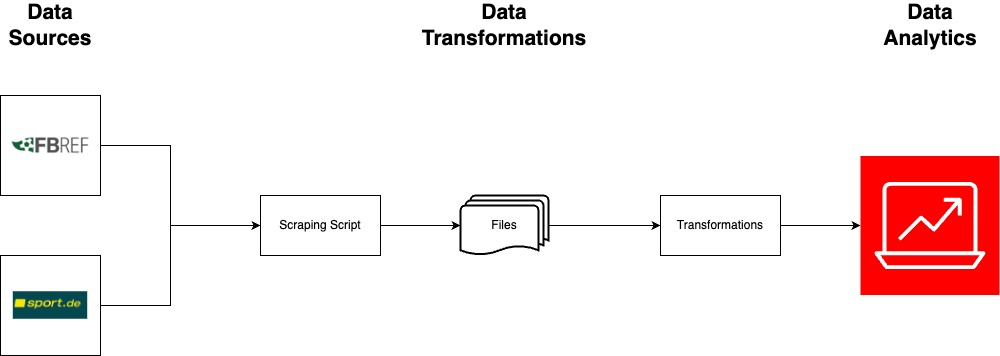

# football-team-analysis

## About

The aim of this repo is to scrape footfall data/statistics from various sources, process, evaluate and visualize them with regard to various KPIs. In this repo, the KPIS are focused on the football style of 1.FC Köln and will be analyzed further below. 

## Data Flow

Two websites serve as data sources. The first is FBref.com, which provides a very wide range of statistics and other data on Bundesliga teams and players for the last seasons. These values are based on the provider Statsbomb. 
On the other hand, the sport.de website is used to obtain information on the running values of the individual teams.
After the data has been scraped, the raw data is saved in a csv format to be cleansed in the next step. Here, unnecessary information that is not required is removed.
The cleansed data from the current season and the previous season is then used to perform the analysis. 
The data flow diagram is shown below. 

## Analysis

As a preface, I would like to point out that the analysis naturally has its limits. The analysis is only possible to the extent that the freely available data allows, and even this data should be treated with caution because the exact definitions behind it are not always known. 
Of course, there is much more data and data types, but these are difficult or even impossible to obtain for private projects. 
That's why I focused on the information that I was able to obtain. 

In order to be able to analyze FC Köln, I first had to understand a few of the FC's playing ideas and I tried to shed light on a few things from this perspective. Especially in comparison to the current season, where FC Köln has not yet been able to build on its performance as in the previous season when it finished in 11th place.

The interesting thing for FC Köln, whose style of play is based on pressing, is to look at key figures such as ball recoveries, running data and tackles. On the offensive side, crosses are a popular means of setting up the powerful strikers. 

### Defensive

On the defensive side of the pitch, various stats can be looked at that contribute a small factor to Cologne's style of play. To do this, we look at ball recoveries, duels and duels won.

In comparison, when it comes to ball conquests, you can see a strong deterioration from the league's third-best values ​​to the league average.
When it comes to duels, FC has maintained its quota and is only marginally worse than in the previous season.

Running and sprinting are basic virtues of the game of football. The positive effects on the game are evident: spaces are condensed, the opponent is put under increased pressure and induced to make mistakes, and you create space yourself by running freely. That's why I took a closer look at the Bundesliga's mileage data and that could also be a factor that contributes to the fact that things aren't going so well at the moment.
From the bundesliga leader in terms of mileage to almost the bottom. The discrepancy here is very large.

Of course, running a lot and fast doesn't score goals, just as money doesn't score goals, but it is undoubtedly beneficial to run or sprint more.

### Offensive

One of the Cologne offensive ways of playing football is the crosses.
The FC does very well here and the numbers clearly show the importance of crosses for the FC's game.

### Outlook

The statistics and analysis are a start, but it has its limitations. With better data, for example, KPIs could be developed to classify pressing behavior in a score to see how well 1.FC Köln presses. However, data such as ball conquests per minute, opponent's ball possession, defensive actions in general per minute in ball possession would be necessary for development.

## Getting Started 

To set up your local development environment, please run:

    poetry install

Behind the scenes, this creates a virtual environment and installs `football_team_analysis` along with its dependencies into a new virtualenv.
Whenever you run `poetry run <command>`, that `<command>` is actually run inside the virtualenv managed by poetry.

You can now import functions and classes from the module with `import football_team_analysis`.

### Testing

We use `pytest` as test framework. To execute the tests, please run

    pytest tests

To run the tests with coverage information, please use

    pytest tests --cov=src --cov-report=html --cov-report=term

and have a look at the `htmlcov` folder, after the tests are done.

### Notebooks

You can use your module code (`src/`) in Jupyter notebooks (`notebooks/`) without running into import errors by running:

    poetry run jupyter notebook

or

    poetry run jupyter-lab

This starts the jupyter server inside the project's virtualenv.

Assuming you already have Jupyter installed, you can make your virtual environment available as a separate kernel by running:

    poetry add ipykernel

    poetry run python -m ipykernel install --user --name="football-team-analysis"

Note that we mainly use notebooks for experiments, visualizations and reports. Every piece of functionality that is meant to be reused should go into module code and be imported into notebooks.

### Distribution Package

To build a distribution package (wheel), please use

    python setup.py bdist_wheel

this will clean up the build folder and then run the `bdist_wheel` command.

### Contributions

Before contributing, please set up the pre-commit hooks to reduce errors and ensure consistency

    pip install -U pre-commit

    pre-commit install

If you run into any issues, you can remove the hooks again with `pre-commit uninstall`.

## Contact

Mark Vollmer (mark-vollmer@web.de)

## License

© Mark Vollmer
